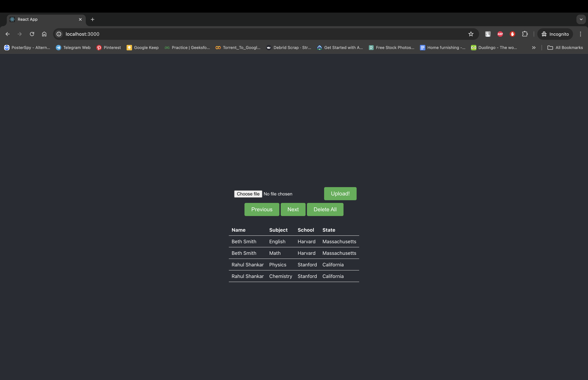
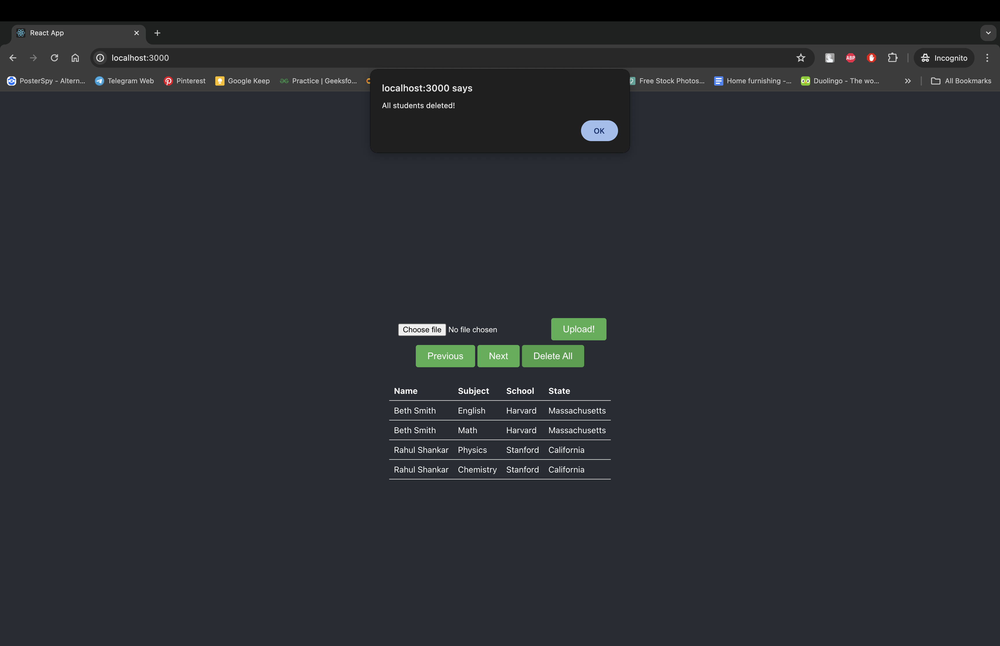
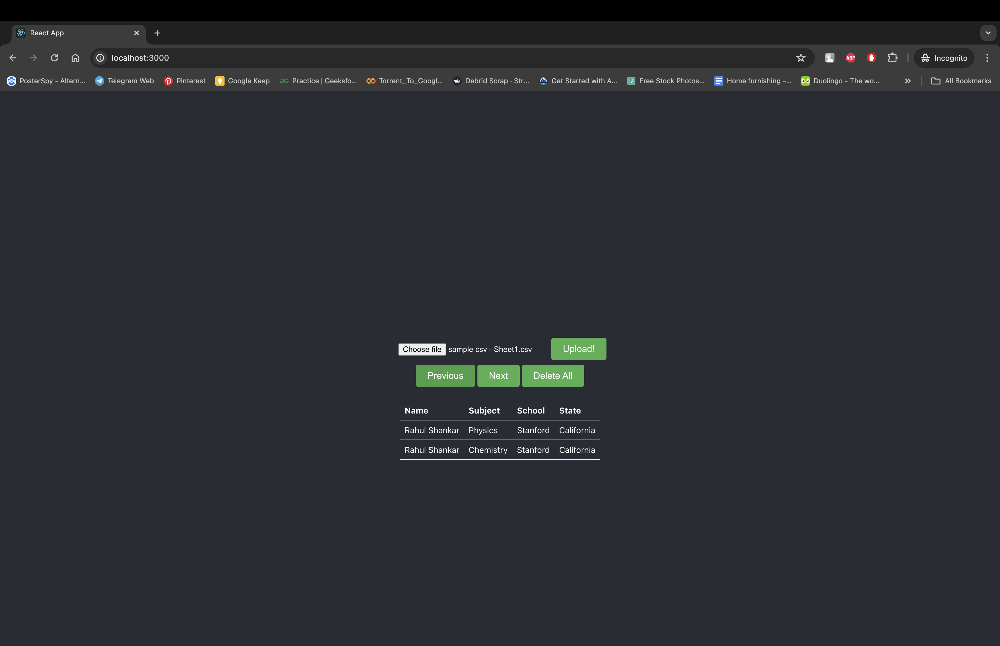
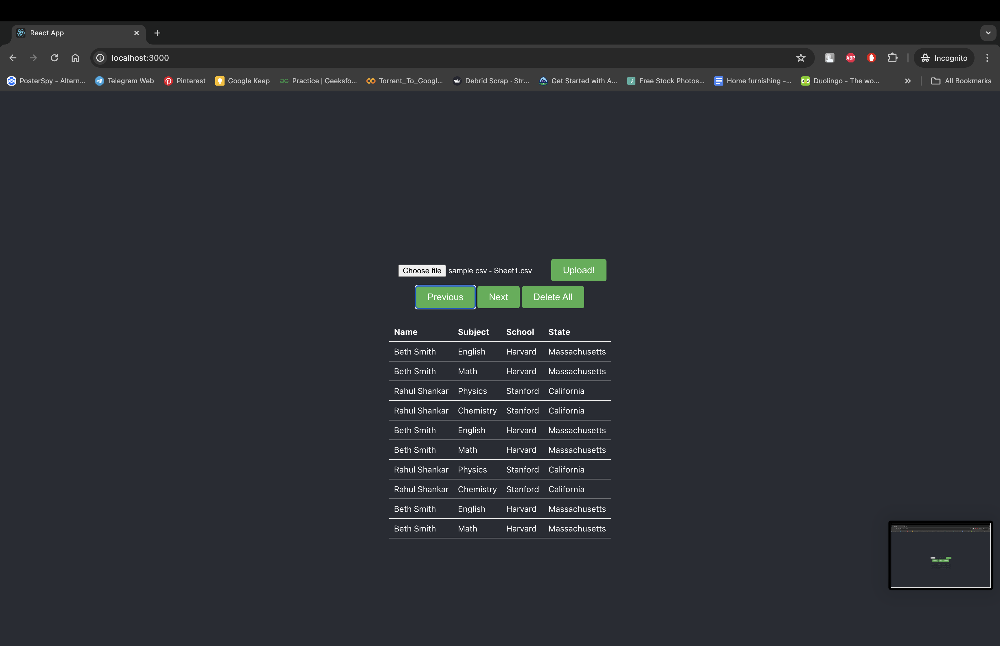

# Student Management Full Stack Application

This repository contains a full stack application for managing student records. The backend is built with Django and serves a REST API, while the frontend is a React application that provides a user-friendly interface.

## Structure

- `/studentapi` - Contains the Django REST API project.
- `/student-csv-frontend` - Contains the React front-end application.

Both directories contain a Dockerfile for containerization of the respective service.

## Quickstart

To get both frontend and backend up and running with Docker, follow these steps:

### Prerequisites

- Docker and Docker Compose installed on your machine.

### Running the Application

1. **Clone the Repository**

    ```bash
    git clone <repository_url>
    cd <repository_root>
    ```

2. **Build and Run with Docker Compose**

    In the root directory (where `docker-compose.yml` is located), run:

    ```bash
    docker-compose up --build
    ```

    This command builds the images for both the frontend and backend if they don't exist and starts the containers.

### Services

The services will be available at the following URLs:

- Backend (Django REST API): [http://localhost:8000](http://localhost:8000)
- Frontend (React App): [http://localhost:3000](http://localhost:3000)

### API Usage

Refer to the `README.md` files in the respective service directories for more details on API endpoints and frontend usage.

## Docker Compose

The `docker-compose.yml` file at the root defines the orchestration for both services. It builds the images, sets up volume mappings for local development, and exposes the necessary ports.

### Environment Variables

Environment variables can be set in the `docker-compose.yml` file under the `environment` section for each service.

### Volumes

The Docker Compose configuration currently maps the local directories to the containers for development purposes. For production deployment, this should be adjusted to copy the code into the images and not use local volumes.

## Sample CSV

For your convenience, a sample CSV file is included in this repository which you can use to test the upload functionality. You can find the sample CSV file here: [samplecsv.csv](./sampleCsv.csv)

Ensure that the CSV follows the format expected by the application. The first row should contain headers with the student attributes, and the following rows should contain the data.


## Project Images




